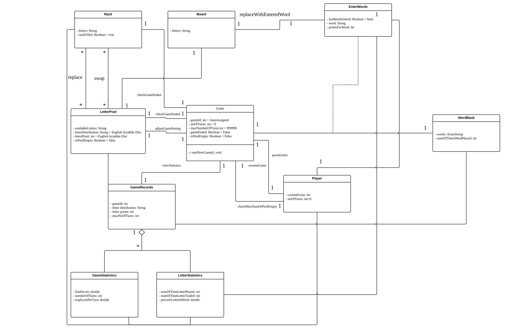
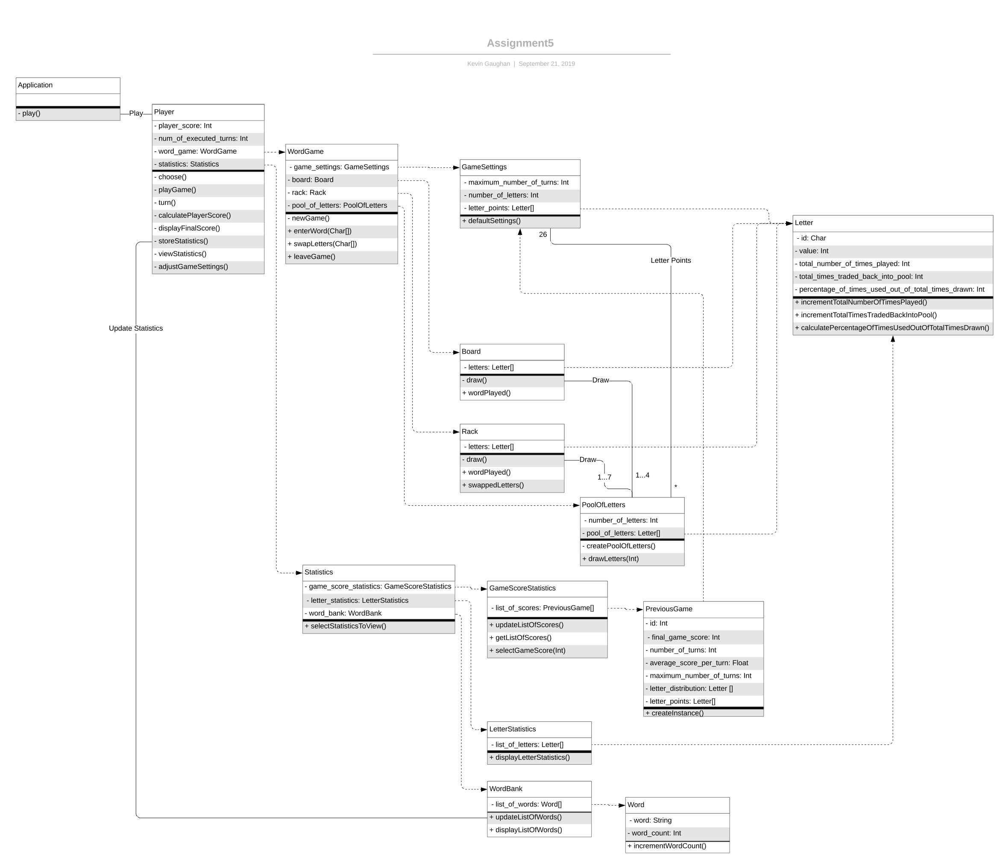
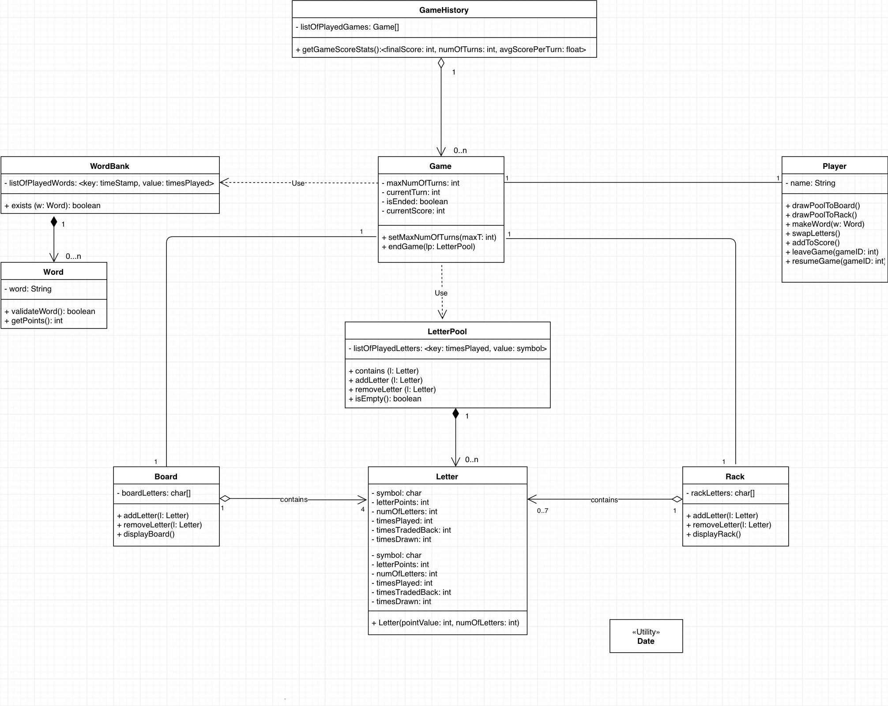
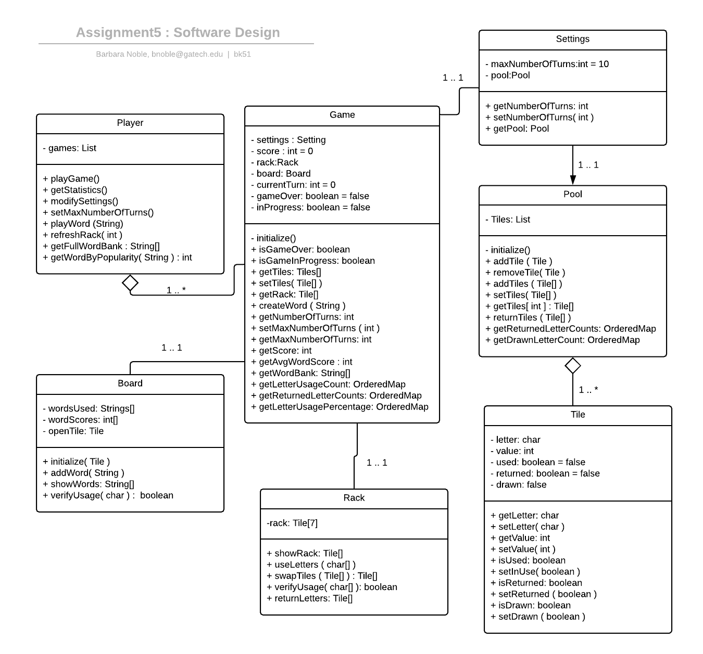
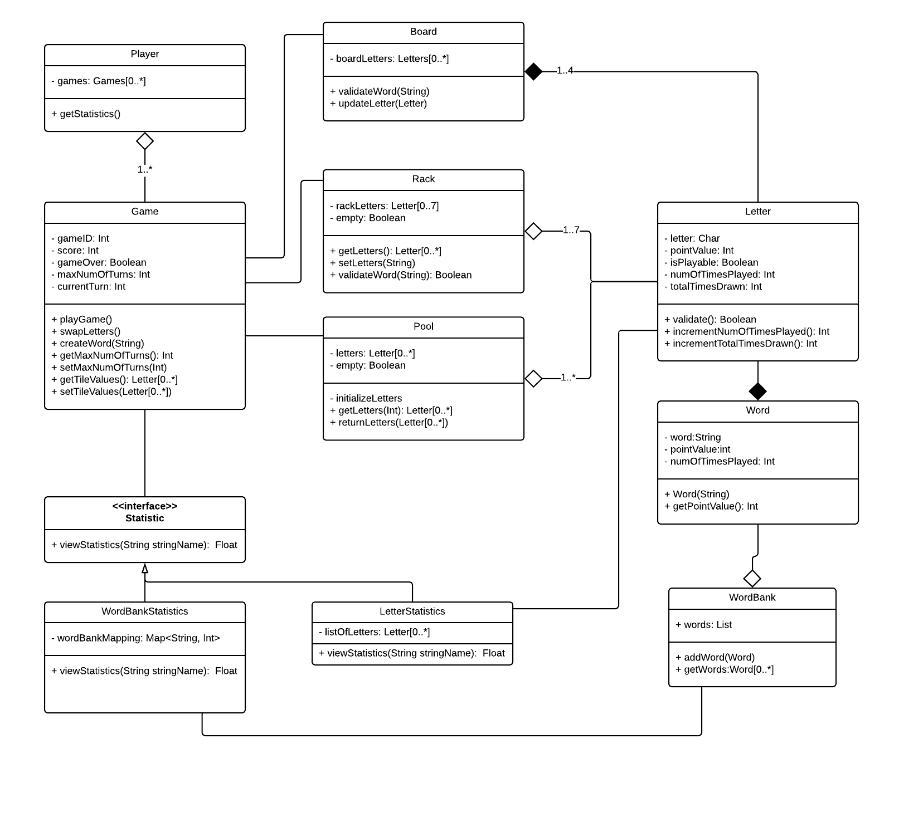

# CS6300, Team 87
# Team Design
#### bk51
#### jshen321
#### kgaughan6
#### xweng8

### Design 1

This design is a little bit hard to follow but the good thing is that it includes all the necessary classes and attributes.

For the cons, many of Design 1’s classes don’t have methods within them but instead placed these methods on the associate line due to being misled by the example video. Moreover, many of the attributes have incorrect type defined, such as using ArrayString or String[ ] instead of String in some of the classes. Another piece missing in the diagram are getters and setters which should have been included where they were necessary to display functionality. Finally, instead of using an association class called EnterWords, a cleaner design would have been to use a class called Letter and this class would also record information needed for the LetterStatistics class.

### Design 2

Overall, Design 2 is easy to follow and has an overall flow from left to right.  All class diagrams represent nouns defined in the Simple Word Game description and contain appropriate attributes and methods.

The relationships are not all clearly defined between classes.  Various aggregations and generalizations need to be defined such as between the Letter class and Board.  Additionally, the use of LucidChart can be improved when defining Class objects.  Despite the ease of following the design from left to right, this may not be the best UML representation of the system and more of a flow diagram.

### Design 3

This is a simple design with clear roles among different modules that the game consists of. Attributes and methods within classes are declared with proper visibilities, return types and Java naming conventions.

However, there are several drawbacks of this design. An obvious one is missing the Statistics class. The design uses a single method getGameScoreStats() to handle all the statistics-related functionalities which is not sufficient. Furthermore, some methods such as leaveGame() and resumeGame() are better placed inside the Game class rather than the Player class. In addition, some relations between classes may not be the most appropriate (eg. misuse of the black and empty diamonds between WordBank and Word, and between Board and Letter, due to confusion of aggregation and composition relations).

### Design 4

This design was succinct and the only design that had the game as a full interface to all items within the game.  The player also had all games as an attribute, which made retrieving an old game or pulling information about the prior games simple to do.  The player was responsible for all aggregation which was also unique, although perhaps not the ideal design.

However, there are shortcomings to this design.  First, it doesn't track the statistics separately from the objects, nor with any type of inheritance.  This means calling on the word bank and pool to calculate statistics on the fly would likely not be fast enough to create the necessary information.  In addition, without a statistics class to aggregate all the information, it would be difficult for the player or game class to do so - this made the classes bloated and gave them functionality that was beyond their scope.  Another shortcoming was not creating a separate class for 'word'.  Using the word bank to manage strings created by the user would not be accountable for all the activities that the word class should be doing.

### Team Design

After discussing as a group, we decided to design an evolved UML diagram of the Simple Word Game. 

There are several aspects that were similar in all the designs submitted, which were also used in the final design.  We all had several similar classes:  Player, Game, Letter, Board, and Rack.  These we all included, with small changes in method assignment to have nearly the same responsibilities.    

The primary difference in our team design and all the individual designs was the use of the “strategy” design pattern for the Statistics class.  Creating this as an interface will allow the Player to retrieve the statistics with a simple call, regardless of the underlying dataset.  Various classes were eliminated and included from the original individual submissions in order to help streamline the UML design.  There was an additional change to Player, in that the Game aggregation was assigned here.  If you had two players, they would have different game histories, and therefore this would be an attribute of the Player.  Also, after refining the number of classes and actions that a given entity can take, we were successfully able to simplify the flow control of the game.  Overall, the team design is more simple and concise than all individual designs while still incorporating all required components of the Simple Word Game.

### Summary
The group discussions were very enlightening for us.  We found that we all had some similarities in the design, talking through our designs and the requirements allowed us to both better understand the task.  Having already created a design also allowed the team to have a better and more engaging discussion regarding the final design.  Working in a distributed program such as OMSCS/OCY, it was also nice to have live feedback and discussions.

Working as a group forced us to discuss and learn about the intricacies of UML design.  We performed a deep dive into designing interfaces and clarified our understanding of relationships between classes.  

By creating an evolved design, this allowed us to go through the process of designing a UML in a team context, which required communication and reasoning skills to decide on a finalized design.

