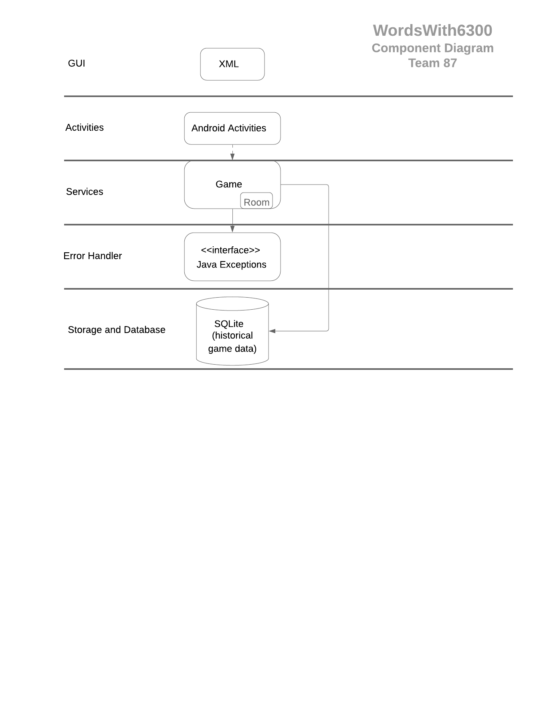
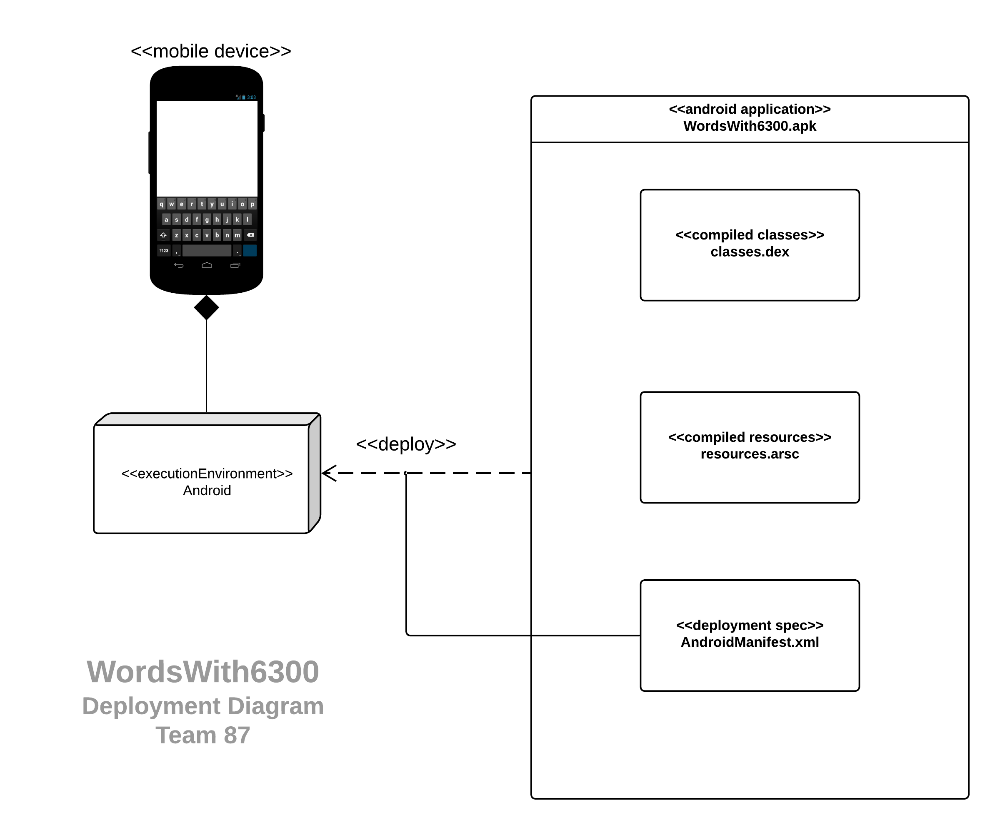
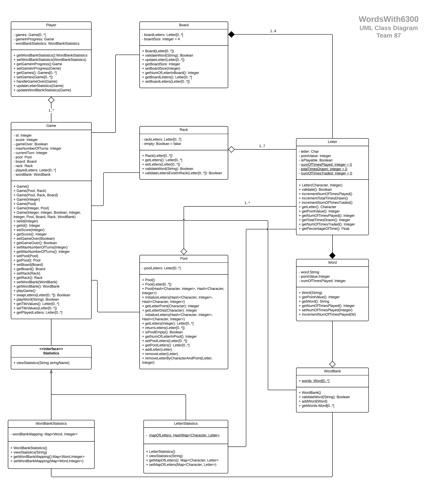
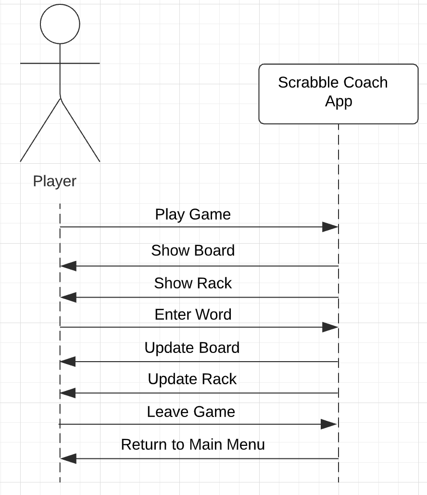
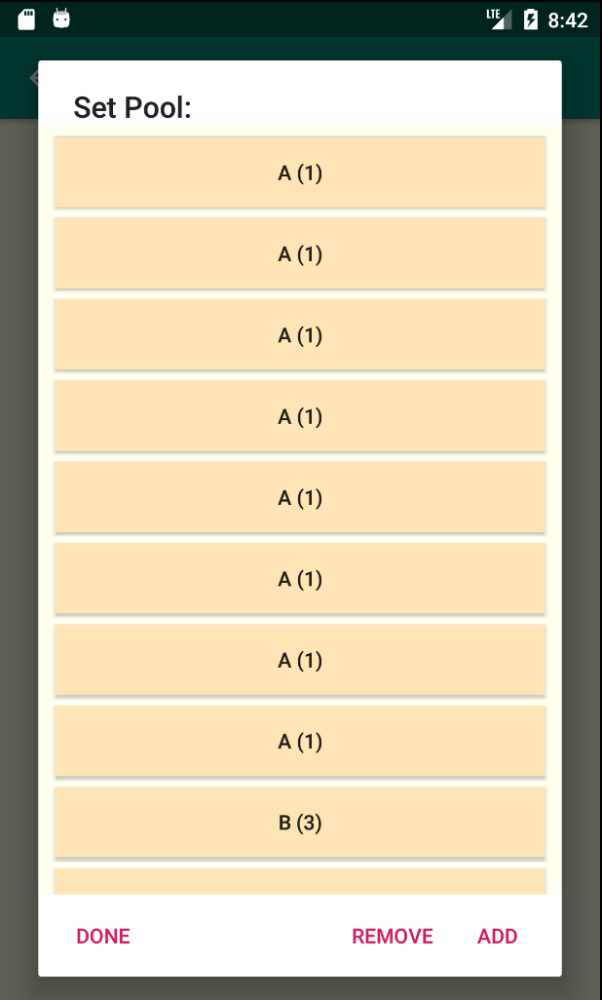

## Design Document

**Author**: Team 87

## 1 Design Considerations

### 1.1 Assumptions

* Assume the UML Class Diagram is accurate and reliable to implement the desired system.
* No additional requirements will be requested by the client until completion.
* The current requirements will not change (i.e. Expected delivery date and time frame will not change.  Approximately 4 weeks to complete the project from design to final product.)
* Team has the necessary tools to get the job done by the desired date (Github, IntelliJ, LucidChart, Microsoft Team *Meetings are all enough tools to properly communicate, document and implement the final product).
* Assume comprehensive understanding of the problem space and what is being asked to deliver.

### 1.2 Constraints

* Android OS
* Minimum Android OS version: Marshmallow
* Smart Phone: Google Pixel 3a
* Development Language: Java 11
* External libraries available
* Manpower available to complete documentation and implement code

### 1.3 System Environment

The ScrabbleCoach app will be available on Android devices and developed using Java 11.  Various smart phones that use the Android OS will be able to run this app including Samsung Galaxy S6 and the Pixel 3a.  

## 2 Architectural Design
### 2.1 Component Diagram

This component diagram illustrates the major components of the macro-architecture of the application and their adjacencies, which can be further separated it into different layers below:
GUI - interacts with the user directly. It includes the screens displayed for the user, as well as all the supporting XML scripts for the App and some light-weight libraries such as bootstrap and jquery.
Activities – contains Domain Activities which handles user inputs or requests before they are further passed to the program. It relies on the Service Layer to provide the correct return value. This Layer also contains Android Activities where all Android SDK specific classes used by the application (Activities, Intents, Adapters, etc.) are located.
Service - encapsulates classes that process game data and implement all the required functionalities in details (Player, Game, etc.)
Error Handler - keeps the robustness of the program with a set of classes handling errors.
Storage and Database - a light-weight physical database file such as SQLite that stores all application-related data on the device, data communication objects as well as fetching historical data on request.
The rationale behind the design of the above-mentioned components in macro-architecture is:
to modularize different components so that automated testing process can be performed separately
to concentrate all functionalities of the App at the Service layer which serves as the core of the architecture
to provide uniform interfaces and allowing execution components of the App communicate with Service layer classes mainly in terms of Android and Domain entities.
### 2.2 Deployment Diagram 

All components of this simple system (including SQLite database and external libraries for the GUI) will be deployed on a single device such as an Android phone. 

## 3 Low-Level Design

### 3.1 Class Diagram

### 3.2 Other Diagrams

Sequence Diagram Resource: https://www.geeksforgeeks.org/unified-modeling-language-uml-sequence-diagrams/

## 4 User Interface Design

