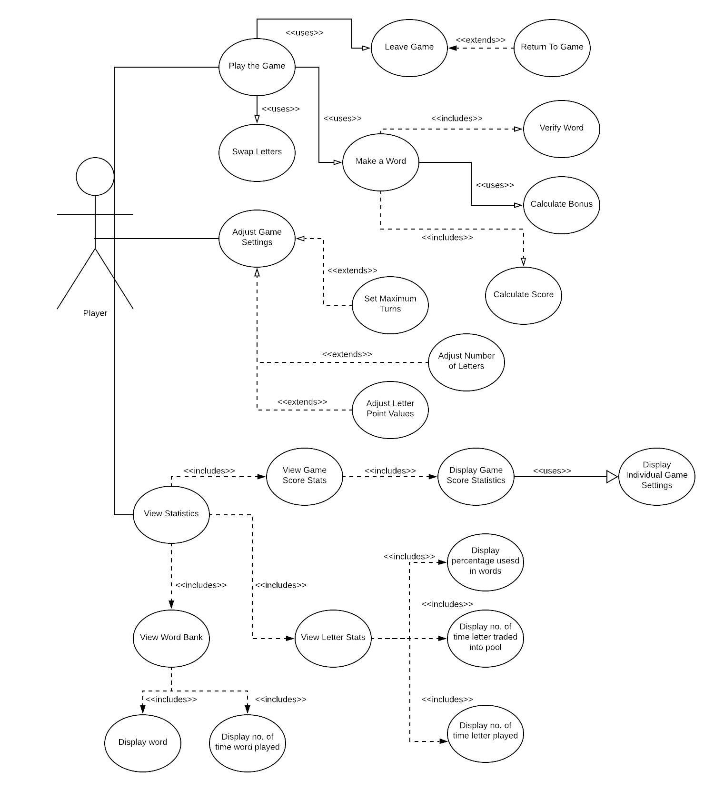

# Use Case Model

**Author**: Team 87

## 1 Use Case Diagram

## 2 Use Case Descriptions

**Adjust Game Settings**
*Actors*: Player
*Requirements*: The use case will allow the player to adjust the maximum number of turns required before terminating a game.  The use case will also allow the player to adjust the number of letters available in the pool of letters.  Additionally, the use case will allow the player to adjust the point value associated with each letter.
*Pre-Conditions*: The player must open the app and select “(3) Adjust the game settings” on the apps homepage.
*Post-Conditions*: After the player customizes their desired settings, these updates must be stored in memory and used next time the player selects “(1) Play a word game” from the home menu.
*Scenarios*:

Scenario 1:

* The player selects “(3) Adjust game settings” from the Scrabble Coach homepage.  
* The player sets the maximum number of turns to “30”.
* The player then returns to the homepage.

Scenario 2:

* The player selects “(3) Adjust game settings” from the Scrabble Coach homepage.  
* The player adjusts the point values associated with the letters “a”, “e”, “i”, “o” and “u” to equal “50” points each.
* The player then increases the number of letters available in the pool of letters to “100”.
* The player then returns to the app homepage. 

**Set Maximum Turns**
*Actors*: Player
*Requirements*: This use case will allow the user to adjust the maximum number of turns.  
*Pre-conditions*: The player must navigate to “Adjust Game Settings”.
*Post-conditions*: After the user adjusts the maximum turns, when they start or return to a game, these settings will be updated.
*Scenarios*:

Scenario 1: 
* The player opens the Scrabble Coach app.
* The player navigates to “Adjust Game Settings”.
* The player sets maximum number of turns to 30.
* The player returns to main menu.
* The player starts a new game.

**Adjust Number of Letters**
*Actors*: Player
*Requirements*: This use case will allow the user to adjust the number of letters appearing in the pool of letters.
*Pre-conditions*: The player must navigate to “Adjust Game Settings”.
*Post-conditions*: After the user adjusts the number of letters, when they start or return to a game, these settings will be updated.
*Scenarios*:

Scenario 1: 
* The player opens the Scrabble Coach app.
* The player navigates to “Adjust Game Settings”.
* The player sets the number of letters to 50.
* The player returns to main menu.
* The player starts a new game.

**Adjust Letter Point Values**
*Actors*: Player
*Requirements*: This use case will allow the user to adjust the letter point values mapping each letter to a specific amount of points.
*Pre-conditions*: The player must navigate to “Adjust Game Settings”.
*Post-conditions*: After the player adjusts the letter point values, when they start or return to a game, these settings will be updated.
*Scenarios*:

Scenario 1: 
* The player opens the Scrabble Coach app.
* The player navigates to “Adjust Game Settings”.
* The player sets the letter point values for “a”, “e”, “i”, “o” and “u” to 50 points.
* The player returns to main menu.
* The player starts a new game.

**Leave the game**
*Actors*: Player
*Requirements*: This use case will allow the player to leave a game in progress at any time and return to the same game at a later point.
*Pre-conditions*: The client must open the Scrabble Coach App and select “(1) Play a word game" from the home page. 
*Post-conditions*: After the client has left the game and then returned to the game, they will be able to continue playing from where they left off.
*Scenarios*:

Scenario 1: 

* The player selects to “Leave game”.  
* The player returns to the main menu and selects “(2) View statistics”. 
* After viewing the statistics, the player returns to the main menu and selects “(1) Play a word game”.  
* The player is then able to continue playing from where they left off.

Scenario 2: 

* The player selects to “Leave game”.  
* They return to the main menu. 
* The player then decides to exit the Scrabble Coach App.  
* At a later time, the player opens the Scrabble Coach App and selects “(1) Play a word game”.  
* The player is then able to continue playing from where they left off.

**Return to game**
*Actors*: Player
*Requirements*: This use case will allow the player to return to a game in progress after exiting.
*Pre-conditions*: The player must have started a game and then exited the game for a temporary amount of time.
*Post-conditions*: After returning to the game, the player will be able to resume play.
*Scenarios*:

Scenario 1: 

* The player selects to “Leave game”.
* The player decides to “Return to game”.
* Game play is then resumed from state it had left.

**View Statistics**
*Actors*: Player
*Requirements*: The use case will allow the player to view three different kinds of statistics.
*Pre-Conditions*: The player must select “(2) View statistics” when the app is started.
*Post-Conditions*: After the player has chosen from one of the three options in View statistics, the App must display the selected statistics in their pre-set form.
*Scenarios*:

Scenario 1:

* The player selects “(1) game score statistics” from the View statistics page. 
* Then Use Case “Display Game Score Stats” will be triggered. 
* Once the statistics are displayed, the app waits for the player to choose to return to the previous page.

Scenario 2:

* The player selects “(2) letter statistics” from the View statistics page. 
* Then Use Case “Display Letter Stats” will be triggered. 
* Once the statistics are displayed, the app waits for the player to choose to return to the previous page. 

Scenario 3: 

* The player selects “(3) the word bank” from the View statistics page. 
* Then Use Case “Display Word Bank” will be triggered.
* Once the statistics are displayed, the app waits for the player to choose to return to the previous page.

Scenario 4:

* The player selects “Go back to previous menu”.
* The app will redirect the player to the home page.
 
**View Game Score Stats**
*Actors*: Player
*Requirements*: This use case will allow the player to view list of scores, in descending order by final game score, displaying some key game information. Furthermore, the player may select any of the game scores to view the settings for that game.
*Pre-conditions*: The player must open the Scrabble Coach App and select “(2) View statistics” then “(1) game score statistics”, with the option of further viewing the settings of a game by selecting one of the game scores from the list.  
*Post-conditions*: After the game score statistics or game settings have been properly displayed, the player will be able to go back to previous menu.
*Scenarios*:

Scenario 1: 

* The player does not select any game from the list of game scores.  
* The app will display a list of game scores in descending order by final game score with three columns: “the final game score”, “the number of turns in the game” and “the average score per turn”. 
* The app will wait for the player to further click a game score to view the settings of that game or go back to the previous menu.

Scenario 2: 

* The player selects one game from the list of game scores. 
* The app will first display a list of game scores in descending order by final game score with three columns: “the final game score”, “the number of turns in the game” and “the average score per turn”. 
* The app will then allow the player to view the settings (maximum number of turns, letter distribution, letter points) of the selected game, then go back to the previous menu.

**Display Game Score Stats**
*Actors*: Player 
*Requirements*: This use case will display to the user a list of scores in descending order by final game score. The displayed information within each record includes: the final game score, the number of turns and the average score per turn in that game
*Pre-conditions*: The player clicked “View Statistics” and then clicked “View Game Score Stats”.
*Post-conditions*: A list of scores in descending order by final game score will be displayed to the player on the GUI.
*Scenarios*:
 
Scenario 1:
* Player opens app.
* Player selects "View Statistics" .
* Player selects "View Game Score Stats".
* List of game scores is displayed.

**Display Individual Game Settings**
*Actors*: Player 
*Requirements*: This use case will enable the player to view the following settings for a selected game in a list a game scores: maximum number of turns, letter distribution and letter points.
*Pre-conditions*: The player clicked “View Statistics”, then clicked “View Game Score Stats” followed by clicking on a particular game tuple from a displayed list of game scores.
*Post-conditions*: Detailed settings of the selected game will be shown on the GUI
 *Scenarios*:

Scenario 1: 
 
* Player opens app.
* Player selects "View Statistics" .
* Player selects "View Game Score Stats".
* Player selects a particular game from the displayed list of game scores.
* Settings of the selected game are displayed.

Scenario 2:
* Player opens app.
* Player selects "View Statistics" .
* Player selects "View Game Score Stats".
* List of game scores is displayed.
* Player goes back to the previous menu.

**View Letter Stats**
*Actors*: Player
*Requirements*: This use case will enable player to view their letter statistics when they are at the start of the game.
*Pre-conditions*: The player must open the Scrabble Coach App, select “(1)View Statistics” from the home page and select “letter statistics” from the secondary page.
*Post-conditions*: The player will be shown the letter statistics and then when done, will return to the “View Statistics” menu
*Scenarios*:

Scenario 1: 

* The player first selects “View Statistics”, then selects “letter statistics”. 
* In such case, letter statistics will be shown on the GUI. 
* When done, the player will click the “go back” button and “View Statistics” menu page will show up again.

Scenario 2: 

* The player has just finished viewing “game score statistics” and wants to view “letter statistics”. 
* In this case, the player is still in the “View Statistics” menu, so the player will click the “letter statistics” button, view the statistics, and when done, click the “go back” button.

Scenario 3:

* The player has just finished viewing “Word Bank” and wants to view “letter statistics”. 
* In this case, the player is still in the “View Statistics” menu, so the player will click the “letter statistics” button, view the statistics, and when done, click the “go back” button.

**Display percentage used in words**
*Actors*: Player 
*Requirements*: This use case will enable player to view the letter percentage used in words.
*Pre-conditions*: The player clicked “View Statistics” and then clicked “View Letter Stats”
*Post-conditions*: Letter percentage used in words will be shown on the GUI
*Scenarios*:

Scenario 1:

* Player opens app.
* Player selects "View Statistics" .
* Player selects "View Letter Stats".
* Letter statistics are displayed.

**Display number of times letter traded into pool**
*Actors*: Player 
*Requirements*: This use case will enable player to view the no. of time letter traded into pool.
*Pre-conditions*: The player clicked “View Statistics” and then clicked “View Letter Stats”
*Post-conditions*: No. of time letter traded into pool will be shown on the GUI
*Scenarios*:

Scenario 1: 

* Player opens app.
* Player selects "View Statistics" .
* Player selects "View Letter Stats".
* Letter statistics are displayed.

**Display number of times letter played**
*Actors*: Player 
*Requirements*: This use case will enable player to view the no. of time letter played.
*Pre-conditions*: The player clicked “View Statistics” and then clicked “View Letter Stats”.
*Post-conditions*: Number of times letter played will be shown on the GUI.
*Scenarios*:

Scenario 1: 

* Player opens app.
* Player selects "View Statistics" .
* Player selects "View Letter Stats".
* Letter statistics are displayed.

**View Word Bank**
*Actors*: Player 
*Requirements*: This use case will enable player to view the word bank when they are at the start of the game.
*Pre-conditions*: The player must open the Scrabble Coach App, select “(1)View Statistics” from the home page and select “Word Bank” from the secondary page.
*Post-conditions*: The player will be shown the word bank and then when done, will return to the “View Statistics” menu
*Scenarios*:

Scenario 1: 

* The player first selects “View Statistics”, then selects “Word Bank”.
* In such case, word bank will be shown on the GUI. When done, the player will click the “go back” button and “View Statistics” menu page will show up again.

Scenario 2: 

* The player has just finished viewing “game score statistics” and wants to view "Word Bank". 
* In this case, the player is still in the “View Statistics” menu, so the player will click the “Word Bank” button, view the statistics, and when done, click the “go back” button.

Scenario 3: 

* The player has just finished viewing “letter score statistics” and wants to view “Word Bank"
* In this case, the player is still in the “View Statistics” menu, so the player will click the “Word Bank” button, view the statistics, and when done, click the “go back” button.

**Display word**
*Actors*: Player 
*Requirements*: This use case will enable player to view the words previously played.
*Pre-conditions*: The player clicked “View Statistics” and then click “View Word Bank”
*Post-conditions*: Words previously played will be shown on the GUI
*Scenarios*:

Scenario 1: 
* Player opens app.
* Player selects "View Statistics" .
* Player selects "View Word Bank".
* Words previously played are displayed.

**Display number of times word played**
*Actors*: Player 
*Requirements*: This use case will enable player to view the no. of time word played.
*Pre-conditions*: The player clicked “View Statistics” and then click “View Word Bank”
*Post-conditions*: No. of time word played will be shown on the GUI
*Scenarios*:

Scenario 1: 

* Player opens app.
* Player selects "View Statistics" .
* Player selects "View Word Bank".
* Words previously played are displayed and corresponding statistics.

**Verify Word** 
*Actors*: Player
*Requirements*: The game has been started.
*Pre-conditions*: A word has been submitted.
*Post-conditions*: The word has been validated.
*Scenarios*: 

Scenario 1:

* The board validates that one letter in the word is an open letter on the board.
* The rack validates that all other letters in the word are in the rack.
* The word bank validates that this word has not yet been submitted in the current game.

**Calculate Score** 
*Actors*: Player
*Requirements*: The game has been started.
*Pre-conditions*: A valid word has been played.
*Post-conditions*: Current score is incremented.
*Scenarios*: 

Scenario 1:

* The values for the letters used in the word are summed.
* The current score is incremented by the word’s summed letter value.

**Calculate Bonus**
*Actors*: Player
*Requirements*:  The game has been started.  A word is played on the board.
*Pre-conditions*: A valid word is played on the board.
*Post-conditions*: A bonus is added to the score.
*Scenarios*:

Scenario 1:

* A word is played on the board.
* Insufficient tiles exist in the pool to fully refill the rack.
* A 10-point bonus is added to the score.
* All remaining tiles in the pool are added to the rack.

**Make Word**
*Actors*: Player
*Requirements*: The game has started.  There are letters on the board and the rack.
*Pre-conditions*: The player has selected letters to make a word.
*Post-conditions*: The word is validated and accepted as a word.
*Scenarios*:

Scenario 1:

* The player has selected letters to create a word.
* The board validates that the currently displayed letter is used.
* The rack validates that the word contains only other letters from the rack.
* The word bank validates that this is not a repeat word.
* The word score is tabulated, and added to the current score.
* The word and word score are added to the word bank.
* The letter statistics are incremented.
* The current turn is incremented.

Scenario 2:

* The player has selected letters to create a word.
* The board determines that no board letters are represented in the word.
* The player is notified that this word is not valid.
* All letters are removed from the screen and the interface waits for the next entry from the player.

Scenario 3:

* The player has selected letters to create a word.
* The board validates that the currently displayed letter is used.
* The rack determines that the letters used were not from the rack.
* The player is notified that this word is not valid.
* All letters are removed from the screen and the interface waits for the next entry from the player.

Scenario 4:

* The player has selected letters to create a word.
* The board validates that the currently displayed letter is used.
* The rack validates that the word contains only other letters from the rack.
* The word bank determines this is a duplicate.
* The player is notified that this word is not valid.
* All letters are removed from the screen and the interface waits for the next entry from the player.

**Swap Letters**
*Actors*: Player
*Requirements*: The game has started.
*Pre-conditions*: The player has selected to swap letters.
*Post-conditions*: New letters are on the rack.
*Scenarios*:

Scenario 1:
* Current turn is incremented.
* Selected letters are returned to the pool.
* The letter statistics are incremented for the selected letters.
* The same number of letters that are selected to return are pulled from the pool.
* New letters are displayed on the rack.

**Play Game**
*Actors*: Player
*Requirements*: The game has started.
*Pre-conditions*: Board has letters.  Rack has letters.
*Post-conditions*: The game is exited.
*Scenarios*:

Scenario 1:

* Create a word.
* Word is verified.
* Score is incremented, number of turns is incremented.
* New letters are placed on the rack, replacing those used.
* Word is created and verified.
* Score is incremented and the number of turns is incremented.
* Rack is filled.
* Repeat above until rack does not have a full number of letters.
* Increment score by bonus.
* Create word with remaining letters.
* Score is incremented and the number of turns is incremented.
* Game over.

Scenario 2:

* Create a word.
* Word is verified.
* Score is incremented, number of turns is incremented.
* New letters are placed on the rack, replacing those used.
* Word is created and verified.
* Score is incremented and the number of turns is incremented.
* Rack is filled.
* Repeat above until max number of turns has occurred.
* Game over.

Scenario 3:

* Create a word.
* Word is verified.
* Score is incremented, number of turns is incremented.
* New letters are placed on the rack, replacing those used.
* Word is created and verified.
* Score is incremented and the number of turns is incremented.
* Rack is filled.
* Swap letters in the rack.
* Increment number of turns.
* Word is created and verified.
* Score is incremented and the number of turns is incremented.
* Rack is filled.
* Repeat above until max number of turns has occurred.
* Game over.

Scenario 4:

* Create a word.
* Word is verified.
* Score is incremented, number of turns is incremented.
* New letters are placed on the rack, replacing those used.
* Word is created and verified.
* Score is incremented and the number of turns is incremented.
* Rack is filled.
* Swap letters in the rack.
* Increment number of turns.
* Word is created and verified.
* Score is incremented and the number of turns is incremented.
* Rack is filled.
* Repeat above until rack does not have a full number of letters.
* Increment score by bonus.
* Create word with remaining letters.
* Score is incremented and the number of turns is incremented.
* Game over.

Scenario 5:

* Create a word.
* Word is verified.
* Score is incremented, number of turns is incremented.
* New letters are placed on the rack, replacing those used.
* Word is created and verified.
* Score is incremented and the number of turns is incremented.
* Rack is filled.
* Swap letters in the rack.
* Increment number of turns.
* At any time, leave game.
* Upon return to game, state is maintained.
* Gameplay continues.
* Game over.

