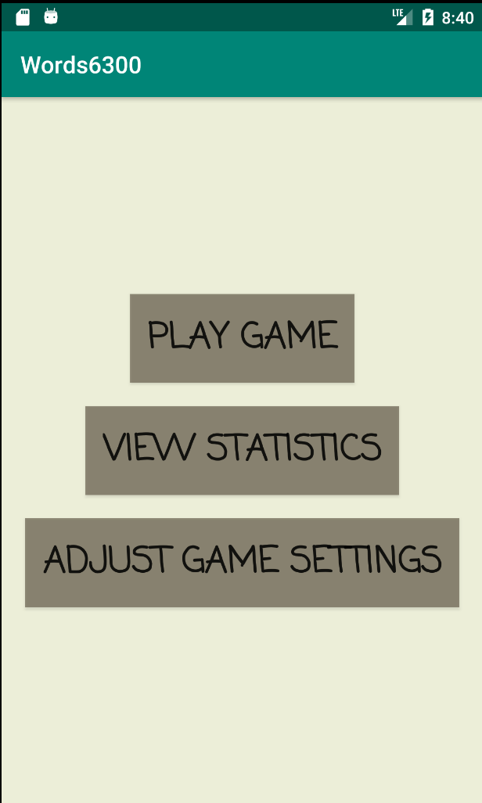
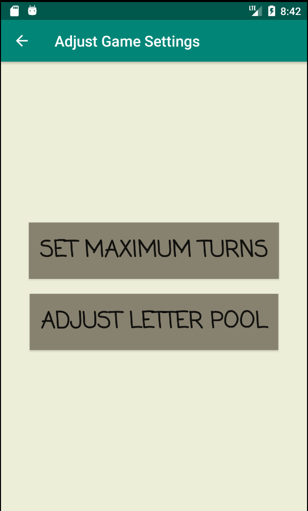
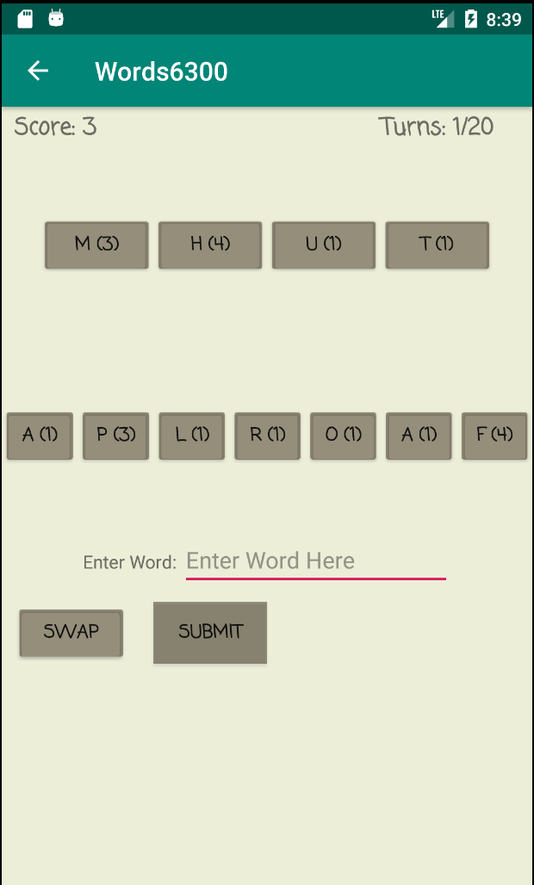
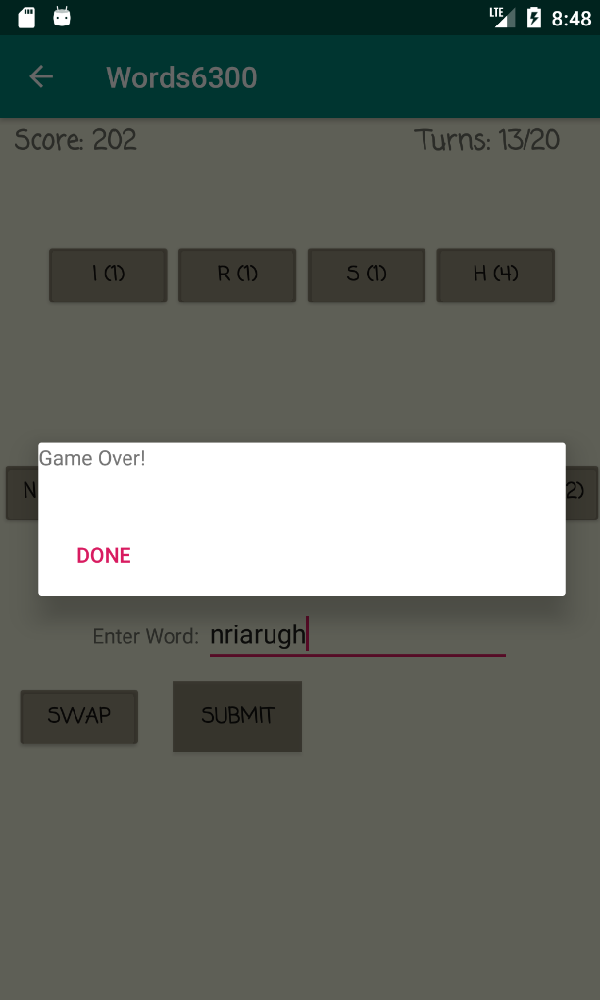
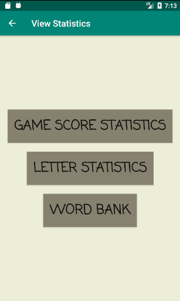
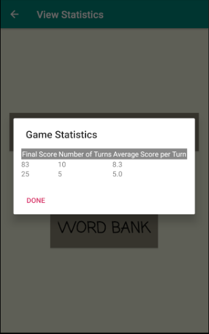
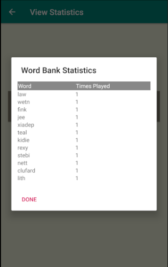

Requirements:

If running from Android Studio, navigate to File -> Project Structure -> Modules and set "Source Compatibility" and "Target Compatibility" to "1.8 (Java 8)".

1. The player can choose to “Play a word game”, “View Statistics” or “Adjust the game settings”.

2. If the player chooses to “Adjust Game Settings” they may update the “Maximum Number of Turns” and/or adjust the “number of letters” and “letter points” assigned to each letter available in the pool of letters.

3. When choosing to “Play a word game”, the player will be shown a “board” and “rack”.

4. The “board” will contain 4 letters drawn from a pool of available letters.
5. The “rack” will contain 7 letters drawn from the same pool.
6. For each turn of the game (up to the maximum number of turns), the player will be able to either “Swap” letters or “Submit” a word.
7. If the player decides to “Swap”, they will enter the desired letters into the "Enter Word" input.   These letters will be removed from the rack and exchanged with new letters from the pool.  The player may swap from 1-7 letters.
8. In order to play a word, the user must input a variable number of letters from the rack and one letter from the board into the "Enter Word" input.
9. If an acceptable word is submitted, the player score will be incremented depending on the values assigned to each letter played.  If an unacceptable word is submitted, then a message will be displayed that states "Invalid word. Please try again."

10. After a word is played, the letter used on the board will be replaced randomly with another letter used in the played word.
11. The rack will also be populated again so that it contains 7 letters.
12. If the pool of letters is empty and the rack cannot be refilled, then the player will gain an additional 20 points added to their score.
13. When the maximum number of turns has been reached or the pool of letters is empty, the game will end.

14. A player can leave a game at any time to “View Statistics” or “Adjust the game settings”.  When the player returns by selecting “Play a word game”, the game will continue from where the player had left off.
15. If the player chooses to “View Statistics” they may select to view “Game Score Statistics”, “Letter Statistics” or the "Word Bank”.

16. The “Game Score Statistics” will allow the player to view the list of scores, in descending order by final game score.  This will show the final game score, the number of turns in that game and the average score per turn.

17. The player may select any of the game scores to view the settings for that specific game.  This includes the maximum number of turns, letter distribution and letter points. 
18. The “Letter statistics” will display the list of letters in ascending order by number of times played.  This will include the total number of times that letter has been played in a word, the total number of times that letter has been traded back into the pool and the percentage of times that the letter is used in a word, out of the total number of times it has been drawn.

19. “The word bank” will provide a list of words used (starting from the most recently played), displaying the word and the number of times the word has been played.

20. Have fun playing Words6300!
